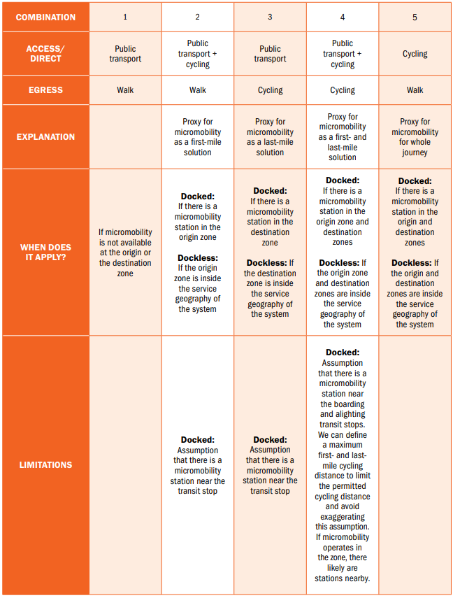
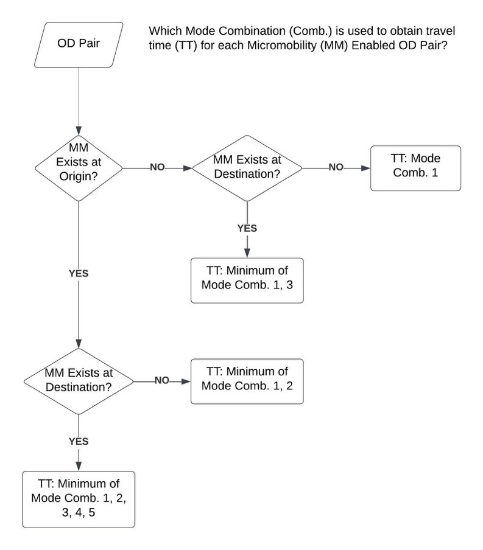

# All Possible Commutes
This repository contains scripts and datasets from the study "*All Possible Commutes - How Micromobility and Realistic Car Travel Times Impact Accessibility Analyses*". The study was conducted by [Transport for Cairo (TfC)](https://transportforcairo.com/) and the [New Urban Mobility Alliance (NUMO)](https://www.numo.global/). The published report and technical appendix can be found [here](https://www.numo.global/resources/all-possible-commutes-accessibility-analysis-micromobility-paper).
 
 ## Repository Overview
 
 The repository is organised into the following folders: 
 ### code
Scripts and edited software tools that comprises the data pipeline enabling accessibility modeling as per our methodology. You will find instructions on how to apply the analysis to the city of your choosing in the README within. Pipeline sequence is as follows:
1. **Pre-processing**: Set of scripts to download and process data from online sources and prepare datasets for analysis.
2. **pbf_augmenter**: Python script that embeds road segment speed data into an OSM PBF road network. More details on this process can be found in the section on [editing osm pbf files](#editing-osm-pbf-files).
3. **Analysis**: Scripts used for calculating travel time matrices and accessibility measures. More details on this process can be found in the section on [micromobility and accessibility](#micromobility-and-accessibility).
4. **Equity**: These scripts are for the equity analysis conducted for US cities (San Francisco Bay Area and Minneapolis-St Paul in our paper)
### data
Intermediate and final data outputs from the analysis. Includes a ["Data Guide" spreadsheet](https://github.com/transportforcairo/wri-numo_access-analysis/blob/main/data/Data_Guide.xlsx) with metadata documentation.
### data_raw
Compiled datasets from multiple sources for chosen cities, includes:
 - GTFS
 - OSM road network
 - GBFS
 - Demographic data
### visuals
Figures and visualizations generated for the report in original quality

## Methods 

### Editing OSM pbf files

#### Sourcing the data 

Freely available, updated data on road-segment level speeds is hard to come by. We used the Uber movement speed dataset [(link)](https://movement.uber.com/explore/london/speeds/query?lang=en-GB&dt[tpb]=ALL_DAY&dt[wd;]=1,2,3,4,5,6,7&dt[dr][sd]=2020-03-01&dt[dr][ed]=2020-03-31&ff=) as well as proprietary Mapbox data. Both give speed data at a high resolution, an OSM road segment (node to node), which rolls up to an OSM Way (collection of nodes).

#### Using the data for routing 

To add traffic data onto road network segments, we need to edit the OSM pbf file that r5 uses to build the routable graph. There is a discussion in r5r about enabling this functionality, but it is still a work in progress [(link)](https://github.com/ipeaGIT/r5r/issues/289). 

Each segment in the speed dataset is labelled with an OSM way ID, a start node, and an end node which can be matched to the segments and ways from a recent download of the OSM road network. This underlines the operability of the speed datasets because OSM networks are consumed by many routing engines.  The [script](https://github.com/transportforcairo/wri-numo_access-analysis/blob/main/code/2_pbf_augmenter/Maxspeed_setter_wfunctions.py) written for this task takes in the road network in .osm format, matches the real speed observed on each way or partial way, and adds a maxspeed tag with the real speed to the copied ways or partial ways. This is because the r5 routing engine uses the maxspeed tag to calculate travel times on roads if they are present. If a maxspeed tag is not available for a road, r5 uses a default based on the road type. The data is matched to the latest OSM build of the road network to create an updated PBF file. 

The logic of the maxspeed_setter script is as follows. We iterate over each way in the OSM network to check if there is a real speed reported from Uber/Mapbox for any of the way's child nodes. For each way, we take the list of nodes and query the speeds dataset for segments with matching start and end nodes. Then we iterate over each reported speed and if its in the same direction of travel as the way, we copy the nodes and all their tags to a new synthetic way with a new way ID, counting sequentuially up from the newwayID_seed provided in the inputs. The new way gets an extra tag “synthetic = yes” as well as a maxspeed tag with its value as the real speed from the speeds dataframe. If there was an existing maxspeed, it is overwritten, otherwise a new maxspeed tag is created. Once all new ways are created, the nodes on the original ways that have been copied to synthetic ways are deleted from the road network. This is done first by removing the copied nodes from the start of the original way, then removing nodes from the end of the copied way, and finally, middle segments of the original way are removed. If the original way is left with gaps in its node sequence, it is replaced with new ways that have continuous node sequences and no real speed tag. Ways left with only one node are deleted.

1. Convert pbf file to xml
    - We used Osmium, a command line tool that works with OSM, to convert the pbf to xml (and back again after the mxspeed_setter function)

2. Run the Python script ["Maxspeed_setter_wfunctions.py"](https://github.com/transportforcairo/wri-numo_access-analysis/blob/main/code/2_pbf_augmenter/Maxspeed_setter_wfunctions.py) from the command line after the following:

    * Change the following input variables in the script: 
       - road_path: the path ro the .xml OSM road network 
       - newwayID_seed: for naming, can be left at 1000
       - output_file_name: a string to name the output .xml file
       - avgspeed: this is the real speed from Uber/Mapbox as csv
       - cityunits: string 'mph' or 'kph'
    - uncomment the colnames and speedsDFpeak variables for the appropriaate data source (Uber or Mapbox) on lines 40,41, and 44
  
3. Convert xml to pbf
    - use Osmium in the command line once again to convert the xml output to pbf

### Micromobility and accessibility

The capabilities of open-source routing engines to model micromobility are a recent development. A standard for micromobility data [(GBFS – General Bikeshare Feed Specification)](https://github.com/MobilityData/gbfs) has been widely adopted only in the past few years. This standard makes (real-time) micromobility data feeds available through an API, and support for it has been added to OpenTripPlanner [link](https://docs.opentripplanner.org/en/v2.0.0/Configuration/#gbfs-configuration). While it is useful for trip planning purposes, a live API does not give us the flexibility required for analysing accessibility or for modeling scenarios.   

#### Approach 

Our proposed approach uses GBFS feeds to obtain the geographic scope of micromobility services, and then uses cycling as a proxy for micromobility when calculating travel times for multimodal trips. The logic is as follows: 
1. Create a variable hexagon grid over the study area (using [this script](https://github.com/transportforcairo/wri-numo_access-analysis/blob/main/code/1_Preprocessing/2.0_variable_hexgrid.R)). This step is optional, as one could use a uniform grid. We prefer to use small (400m diameter) hexagons to justify the assumption that people inside a hexagon have the same public transport and micromobility options. Creating a uniform 400m hexagon layer to cover any big city can lead to computationally expensive routing in step 4 (for n zones, we have n2 calculations). To reduce the number of calculations, we can create this variable hexagon grid where hexagons are smaller for high population/employment density areas, and larger in low population/emploment density areas. 
2. Identify locations of micromobility (using [this script](https://github.com/transportforcairo/wri-numo_access-analysis/blob/main/code/1_Preprocessing/1_extract-get_gbfs.R))
   - Docked: station locations 
   - Dockless: service area 
3. For each zone (grid unit), determine whether it is served by micromobility or not (using [this script](https://github.com/transportforcairo/wri-numo_access-analysis/blob/main/code/1_Preprocessing/2.3_transform-gbfs2zones.R)). For each zone, we consider availability of micromobility at neighboring zones as well. 
4. Determine travel time between each zone pair, i.e., OD-pair, using availability of micromobility to determine possible intermodality. Cycling is used as a proxy for micromobility when specifying modes in the routing engine. We create multiple travel time matrices using different mode combinations (see Table 1) . This is done using [this script](https://github.com/transportforcairo/wri-numo_access-analysis/blob/main/code/3_Analysis/3.1_analysis-travel_time_r5.R))
5. Use results from steps 3 and 4 to get travel time using micromobility for each OD pair. The travel times are based on the availability of micromobility, as shown in the table below. This is done using [this script](https://github.com/transportforcairo/wri-numo_access-analysis/blob/main/code/3_Analysis/3.2_analysis-travel_time_scenarios.R)).

 

The flowchart below shows the heuristic used to determine which mode combination to use for each OD pair

 
 

#### Examples of Results

##### Spatial Distribution of Docked Micromobility (Cairo, Egypt)

##### Accessibility to Jobs - Improvement due to Docked Micromobility (Cairo, Egypt)

